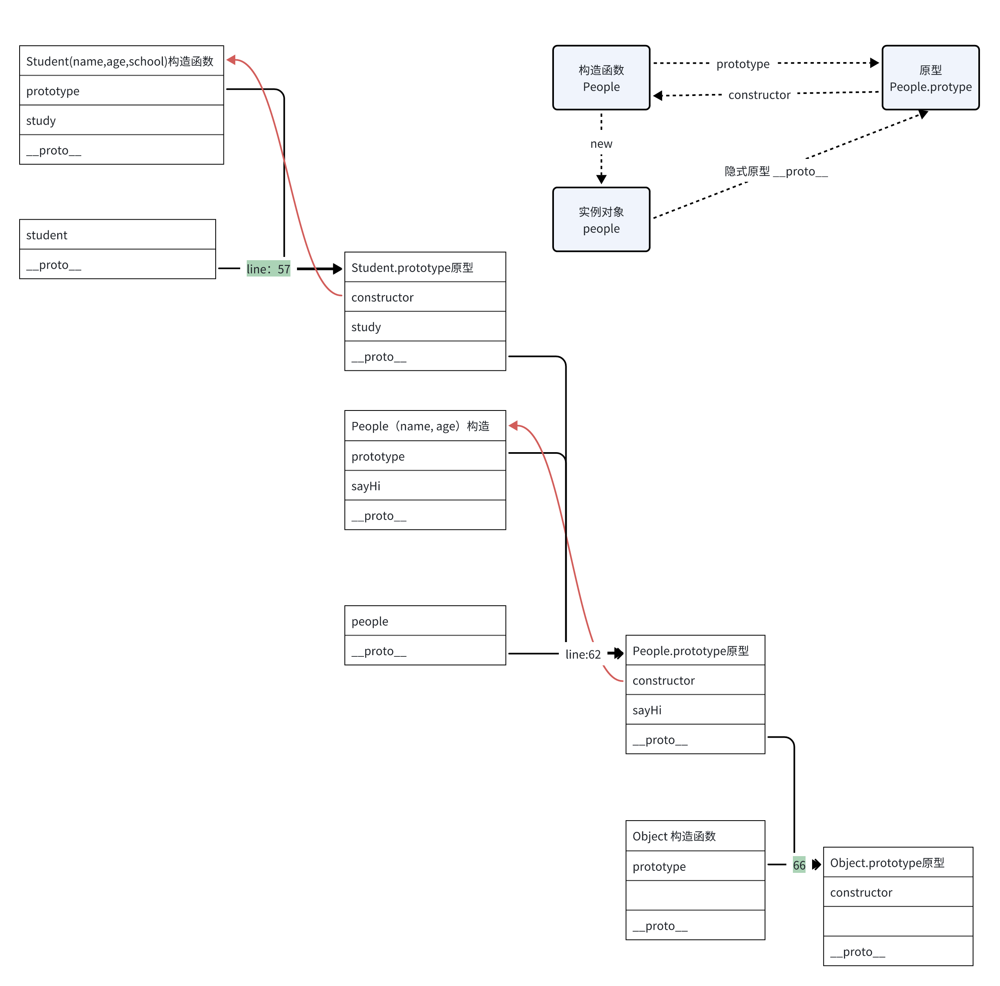

# 原型和原型链
:::info
code
:::
<ClassDemo />

## 谈谈你对原型的理解
每个函数在创建时都会生成一个名为prototype的属性。这个属性指向一个对象，即该函数的原型对象。

## 什么是原型链
- 原型链是原型对象创建过程的历史记录。
- 当访问一个对象的属性时，JavaScript会在对象本身属性上查找，然后在原型对象上查找，一直向上搜索，直到找到匹配的属性或到达原型链的末尾.
- 每个实例对象都有一个属性__proto__，它指向构造函数的原型对象。

## 原型关系
- 每个Class都有显示原型prototype
- 每个实例都有隐式原型_proto_
- **实例的隐式原型（__proto__）指向对应的class的显式原型（prototype）**
- **当使用类（class）定义一个对象时，类的原型最终会指向内置的 Object.prototype**

[参考链接：掘金](https://juejin.cn/post/7095651623812202533)
