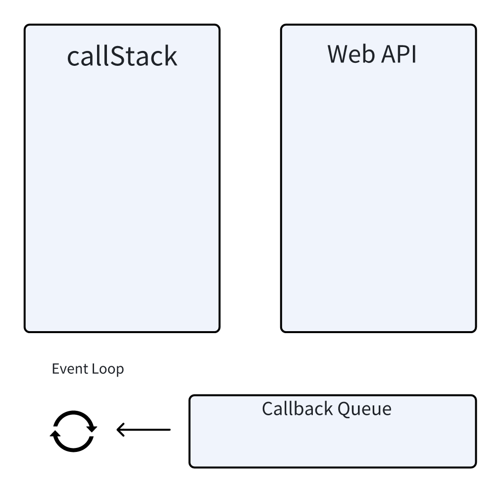

# 异步

## 浏览器如何渲染网页
### 浏览器主要进程
- 浏览器进程：主要负责界面显示、用户交互、子进程管理。浏览器进城内部会启动多个线程处理不同的任务。
- 网络进程：负责加载网络资源。网络进程内部会启动多个线程来处理不同的网络任务。
- **渲染进程**：渲染进程启动后，会开启一个渲染主线程，主线程负责执行HTML、CSS、JS代码。
  - 默认情况下，浏览器会为每个标签页开启一个新的渲染进程，以保证不同的标签页之间不相互影响。
### 渲染主线程是如何工作的
- 解析HTML
- 解析CSS
- 计算样式
- 按帧率绘制图层
- 执行全局JS代码
- 执行事件处理函数
- 执行计时器的回调函数

**案例**
<render />

### 如何理解JS的异步
渲染主线程承担着渲染页面、解析执行JS的任务。遇到比较耗时的操作，比如定时器、网络请求、事件监听，交给WebAPI处理。当WebAPI处理完成后，将事件包装成任务，放入任务队列。等待主线程调度。

## 异步编程的原理
1. JavaScript 引擎是单线程的，一次只能执行一个任务。
2. 异步任务（如定时器、事件监听、网络请求等）不会阻塞主线程的执行，而是会在后台执行。
3. 当异步任务完成时，会将回调函数放入任务队列（Callback Queue）中。
4. 主线程执行完当前任务后，会从任务队列中取出一个回调函数执行。
5. 这个过程是循环的，即事件循环（Event Loop），使得 JavaScript 能够处理异步操作。

## 异步编程的实现方式
- 回调函数
- Promise 链式调用
- async （语法糖，如果await返回一个promise，函数将会等待promise对象转换为resolve后继续向下执行）

## event loop 机制和DOM渲染
js是单线程的，而且和DOM渲染共用一个线程
js执行的时候，得留一些时机供DOM渲染

## 宏任务和微任务
宏任务：setTimeout、setInterval、Ajax、DOM事件

微任务：Promise、async/await

微任务执行比宏任务早  微任务-->DOM渲染-->宏任务

