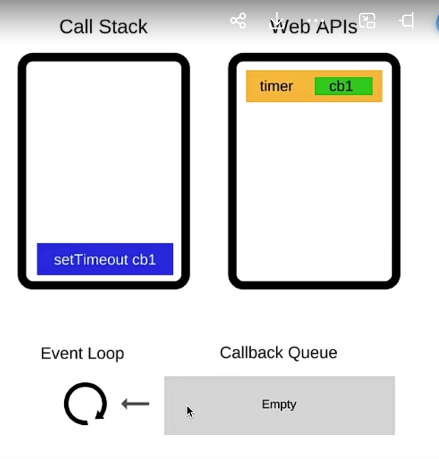

# 异步

## 异步编程的原理
1. JavaScript 引擎是单线程的，一次只能执行一个任务。
2. 异步任务（如定时器、事件监听、网络请求等）不会阻塞主线程的执行，而是会在后台执行。
3. 当异步任务完成时，会将回调函数放入任务队列（Callback Queue）中。
4. 主线程执行完当前任务后，会从任务队列中取出一个回调函数执行。
5. 这个过程是循环的，即事件循环（Event Loop），使得 JavaScript 能够处理异步操作。

## 异步编程的实现方式
- 回调函数
- Promise 链式调用
- async （语法糖，如果await返回一个promise，函数将会等待promise对象转换为resolve后继续向下执行）

## event loop 机制和DOM渲染
js是单线程的，而且和DOM渲染共用一个线程
js执行的时候，得留一些时机供DOM渲染

## 宏任务和微任务
宏任务：setTimeout、setInterval、Ajax、DOM事件
微任务：Promise、async/await
微任务执行比宏任务早  微任务-->DOM渲染-->宏任务

## promise哪三种状态，如何变化
pending（进行中） fulfilled（已成功）reject（已失败
