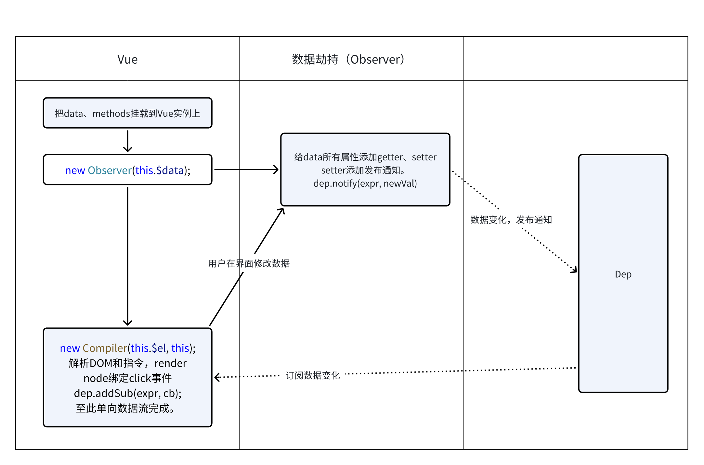

# vue响应式原理

## 数据劫持
- Object.defineProperty: 劫持属性。重写get、set方法劫持数据
- Proxy: 代理对象。重写get、set 方法劫持数据
  [数据劫持demo](http://127.0.0.1:5500/example/jiechi/index.html)

## 单例模式
[单例模式](/设计模式/单例.html)
## 发布订阅模式
[发布订阅](/设计模式/发布订阅.html)
## createDocumentFragment
[createDocumentFragment](http://127.0.0.1:5500/example/createDocumentFragment.html)
## mvvm模式
[MVVM](/设计模式/MVVM.html)

## 响应式原理
参考文章：

[深入响应式原理：vue2](https://v2.cn.vuejs.org/v2/guide/reactivity.html)

[深入响应式原理：vue3](https://cn.vuejs.org/guide/extras/reactivity-in-depth.html)

[实现简单的MVVM：简书](https://www.jianshu.com/p/0983d2d0a416)

[简书code](http://127.0.0.1:5500/example/vue/index.html)

Vue 2 使用了 Object.defineProperty 方法对数据对象进行劫持。通过该方法可以定义对象的属性，并在属性的读取（get）和设置（set）过程中添加额外的逻辑。

模板编译：在模板编译阶段，Vue 会解析模板中的指令和表达式，并为每个指令和表达式创建对应的 Watcher 对象。这些 Watcher 对象会订阅相应数据的变化，并在变化时触发更新操作。

数据劫持：当 Vue 实例初始化时，会遍历数据对象的所有属性，并使用 Object.defineProperty 方法将这些属性转化为 getter 和 setter。在 setter 中触发更新，即通知依赖该属性的 Watcher 对象进行更新。

Watcher：Watcher 是 Vue 的一个核心概念，用于建立数据与视图之间的关联。在模板编译过程中，会解析模板中的指令和表达式，并创建对应的 Watcher 对象。Watcher 对象会订阅数据对象的属性的变化，并在属性变化时触发更新。

Dep：Dep（Dependency）是一个依赖管理器，用于管理依赖关系。每个被劫持的属性都会关联一个对应的 Dep 对象。在 getter 中，Watcher 对象会将自身添加到对应属性的 Dep 对象的依赖列表中。而在 setter 中，Dep 对象会通知所有依赖于它的 Watcher 对象进行更新。

Dep: Dep是一个事件总线，发布者和订阅者的沟通桥梁。

## vue双向绑定实现

1. observer 劫持数据
  - 递归代理数据，或者递归劫持数据属性。
  - 数据变化通知订阅者
2. compile 解析模板指令
  - 把模板中的变量解析成数据
  - 根据指令绑定事件
  - 添加订阅者，如果数据变化，收到通知，更新视图。
3. Watcher类是连接observer和compile的桥梁。扮演事件总线的角色。

**最终自己实现的版本：**
[MVVM](http://127.0.0.1:5500/example/jiechi/mvvm.html)

